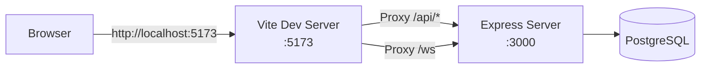

# Development Setup Guide

## 🚨 Common Issues and Solutions

### WebSocket and API Errors

**Symptoms:**
- `WebSocket connection to 'ws://localhost:undefined/?token=...' failed`
- API calls return HTML: `Unexpected token '<', "<!DOCTYPE "... is not valid JSON`
- Tab 3 not loading data properly

**Root Cause:**
You're accessing the app at the wrong URL!

## ✅ Correct Development Setup

### 1. Start Both Servers

**Option A: Run both servers together (recommended)**
```bash
npm run dev:all
```

**Option B: Run servers separately in two terminals**
```bash
# Terminal 1: Backend server (Express + API)
npm run dev:backend

# Terminal 2: Frontend server (Vite)
npm run dev:frontend
```

### 2. Access the Application

| URL | Purpose | Status |
|-----|---------|--------|
| `http://localhost:5173` | ✅ **CORRECT** - Use this! | Frontend with proxy |
| `http://localhost:3000` | ❌ **WRONG** - Don't use! | Backend only, no proxy |

## 🔧 How It Works



### Port Responsibilities

- **Port 5173 (Vite)**
  - Serves React application
  - Hot Module Replacement (HMR)
  - Proxies API and WebSocket requests to Express
  - Handles client-side routing

- **Port 3000 (Express)**
  - API endpoints (`/api/*`)
  - WebSocket server (`/ws`)
  - Database connections
  - Session management

## 📊 Database Schema

The application uses PostgreSQL with the following main tables:

- `sessions` - User sessions
- `lagrangian_results` - Tab 1 genetic algorithm results
- `relativity_results` - Tab 2 physics test results  
- `theory_results` - Tab 3 unified theory analysis
- `test_results` - Individual test runs from Tab 3

All tables use proper foreign key relationships to the sessions table.

## 🐛 Troubleshooting

### If you see WebSocket errors:
1. Check you're using `http://localhost:5173` NOT port 3000
2. Ensure both servers are running
3. Check browser console for specific error messages

### If API calls return HTML:
- You're accessing port 3000 directly
- Switch to `http://localhost:5173`

### If data doesn't load in Tab 3:
1. Complete Tab 2 tests first (Tab 3 depends on Tab 2 data)
2. Check browser DevTools Network tab for failed requests
3. Ensure session is active (check Tab 5 - Data Management) 